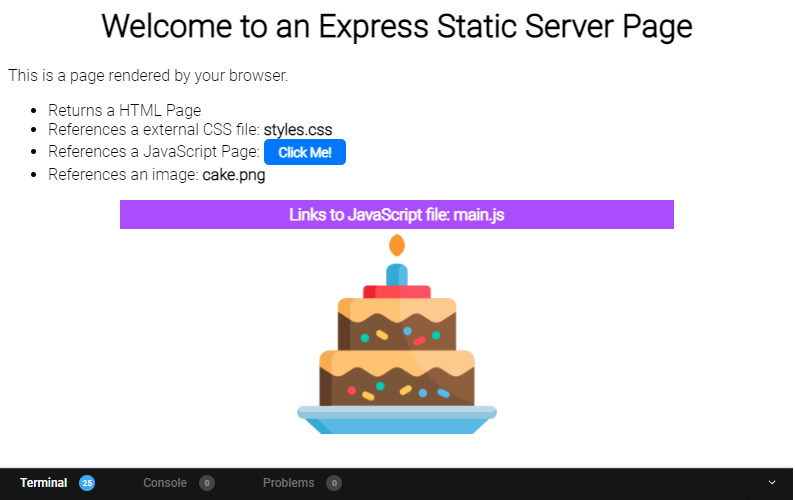

# Node.js Starter Files

## Node.js, Part 2 

### Task: Create a Server

1. Open your __Node.js Starter Files__ project. The link to this project can be found on the Course Info page in the learning platform. 

1. Open the __simple-nodejs-server__ project folder in Visual Studio.  The code below is an example of a node server. The server will return the text 'Hello World!' when you visit the URL http://127.0.0.1:8080

```js
const http = require("http");

http
  .createServer(function (req, res) {
    res.statusCode = 200;
  res.setHeader('Content-Type', 'text/plain');
  res.end('Hello, World!');
  }).listen(8080);
```

3. Run the application with the command `node index.js` from the command line.

1. Visit http://127.0.0.1:8080 to see the results in a browser.

1. Change the response to "Welcome to my server!"

1. In the terminal window stop the application (Ctrl+c or ⌘+c)  and restart the application to see the changes (`node index.js`)


7. Open the Developer's Tools (F12 in windows) in your browser and the Network tab to see the status code and the type returned

1. Change the status code to 500 and return the  message "Oops! Something went wrong"

1. Restart the application from the terminal and refresh the browser to see the result

---

## Node.js, Part 3

### Task: Node File System

1. Open the __node-server__ folder in Visual Studio Code
1. Add a file in the root folder (outside of the `src` folder) called __textfile.txt__
1. Add the following lines of text to __textfile.txt__
1. In the terminal start the application with the following command to run your code:<br/>
`node src/index.js`

1. If you review the terminal you should see the contents of the __textfile.txt__ being written to the console

1. In Visual Studio add another file to the __root__ folder called __index.html__
1. Add the following lines of text to index.html

```html
<html>
  <head>
    <title>Basic Server Page</title>
  </head>
  <body>
    <h1>Welcome to a Basic Server Page</h1>
    <p>This will render in your <strong>browser</strong>.</p>
  </body>
</html>
```

8. Open the __src/index.js__ file and replace the reference to __textfile.txt__ to __index.html__ 

1. When you run your server: <br/>`node src/index.js`
1. The console should contain the __index.html__ file content
1. The terminal will only output text. So the raw HTML is displayed 
---

## Node.js, Part 3 

### Task: Building a Server

1. Next we are going to load and render a basic HTML file from our server

1. In the __node-server__ folder update the __index.html__, replace the file content with the  following:

```html
<html>
  <head>
    <title>Static Server Page</title>
  </head>
  <body>
    <h1>Welcome to a Static Server Page</h1>
    <p>This is a page rendered by your browser.</p>
    <ul>
      <li>Returns a HTML Page</li>
      <li>References a CSS Page</li>
      <li>References a JavaScript Page</li>
      <li>References an image</li>
    </ul>
  </body>
</html>
```

3. Replace the code in __index.js__ with the following:

```js
var http = require("http"),
  fs = require("fs");

var server = http
  .createServer(function (request, response) {
    fs.readFile("./index.html", function (err, html) {
      if (err) {
        throw err;
      }
      response.writeHeader(200, { "Content-Type": "text/html" });
      response.write(html);
      response.end();
    });
  })
  .listen(8080);
```
4. The code will read the __index.html__ file and return it's contents when a client makes a request
1. It uses the `filesystem` (`fs`) module to access and interact with the HTML file

11. Start your server with the `node src/index.js`. Visit the URL `http://localhost:8080/` Your HTML file should be loaded

12. Change the URL to http://localhost:8080/testing

__What happens?__

Currently all request from a client will return the contents of `index.html`

Add conditions to the `index.js` code to return the index.html page only if the following conditions are met: 

13. Request Method is `GET`
1. The URL ends with `"index.html"`
1. Or the URL ends with `"/"`

Return status code `404` and message `"Sorry file not found"` for all other requests

```js
//1. Request Method is GET
req.method === "GET"

//2. The URL ends with "index.html"
req.url.endsWith("index.html")

//3. OR URL ends with "/"
req.url.endsWith("/"))
```

Test your server returns the correct responses to the following requests*:

http://localhost:8080 and http://localhost:8080/index.html should both return the __index.html__ page:

http://localhost:8080/123 should return a `404` status. Check the browser Network tab in Chrome for the the status code (you can also use Postman).


### Task: Express Routing

In the following task we will be reading objects from a JSON file called `profiles.json` and returning information based on the express route requested
1. Open the __node-server__ folder.
1. n a terminal run `npm install` to add the Express dependencies.
1. Open the file __server.js__
1. Add a route to the __server.js__ file with code that will return the contents of the JSON file __profiles.json__ when a user visits the following URL:

`http://localhost:8080/profiles`

5. Ensure the __Content-Type__ is set to `application/json`:

`res.writeHead(200, { "Content-Type": "application/json" });`

6. Save the code and run the node server `node src/server.js` to run the server.

1. You can also open Postman or Chrome and visit the URL: http://localhost:8080/profiles to see the results

1. Add another route that returns a list of the profile __names__ and __bio__ from the server as HTML elements on the endpoint below

`GET` http://localhost:8080/profiles/view

```html
<h1>Profiles:</h1>
<h2>Maya Angelou</h2>
   <p>American poet, singer, memoirist, and civil… </p>
<h2>Toni Morrision</h2>
…
```

Open the browser and visit http://localhost:8080/profiles/view to see the results


## Node.js, Part 4

### Task: Writing and Logging

1. Open the __logger__ folder in your Node starter files project
1. Run `node install` from a terminal to install the Express dependencies
1. The file __src/server.js__ contains the following code:
1. Each path returns a different greeting. Start the server with the following command `node src/server.js`
1. Open Postman and visit http://localhost:8080. Enter different paths to see the results e.g. 

```js
const express = require("express");
const app = express();

app.get("/", (req, res) => {
  res.send("Morning");
});

app.patch("/greet", (req, res) => {
  res.send("Good Evening");
});

app.post("/bye", (req, res) => {
  res.send("Good Night");
})

app.listen(8080, function() {
});
```

6. Create a logging module to log all of the requests made to the server in a file called __log.txt__

1. Each log in the __log.txt__ file should contain
- The date and time of the request
- The request method (`GET`, `PATCH`, `POST`)
- The output sent back to the client

```
2021/11/25 09:38:20 - GET "Morning"
2021/11/25 09:38:22 - POST "Good Evening"
2021/11/25 09:38:23 - PATCH "Good Night"
```

### Task: PUT Request

1. In the last session, you created a server that returned JSON profile objects from a data file called __profiles.json__. Open the __logger__ folder, add a path to the __server.js__ file 

1. Add a `PUT` request to the server with the following route: `/api/profiles/:id`. The `PUT` request will expect a JSON object

1. When a client sends a PUT request to the endpoint above, update the file __profiles.json__ to include the new profile information

1. To test the endpoint, open Postman or any other API tester and post the example JSON below to the endpoint: `http://localhost:3000/profiles/2`

2. Example JSON: 

```json
{
  firstname: 'Jessica', 
  lastname : 'Jones', 
  age:35
}
```

The endpoint call back function should:
 
- Find the profile with id `2` in the __profiles.json__ file
- Replace the existing JSON object in the __profiles.json__ file with the incoming JSON

6. Ensure that the `id` is available in the __profile.json__ file.  If it is not available, return a `404` status code and appropriate message (e.g. Sorry, file not found). 

__Success__
- Request URL: `PUT/ http://localhost:3000/profiles/1`
- Request Body: `{firstname: 'jessica', lastname : 'Jones', age:35}`
- Response Status: `200 OK`
- Response Body: `List of all the profiles including the updated profile`_`

7. In the above case the profile with id `1` will be completely replaced with the new profile object above and an updated list of profiles will be returned

__Fail__
- Request URL: `PUT/ http://localhost:3000/profiles/567`
Request Body: `{firstname: 'jessica', lastname : 'Jones', age:35}`
Response Status: `404 Not Found`
Response Body: `Unable to update. Profile was not found`

8. In the above example the profile with id `567` does not exist in the current __profiles.json__ file. The server should respond with a `404` status and  appropriate error message
___

## Node.js, Part 5

### Static Express File Server

1. For this task you are going to create a static file server using __express__.
1. The server will return a single [index.html](./src/public/index.html) page as the homepage.

1. When a user visits the following URL, the [index.html](./src/public/index.html)  page will be displayed:
https://localhost:8080/
1. Open the __static-file-server__ folder. The folder contains the basic files for this task.
1. Ensure all the necessary node library dependencies have been installed. 

```
npm install
```

6. Add code to [index.js](./src/index.js) to enable static files (images, css, js files) to be served from a _virtual path_ called **content** and the physical directory **public**. Use middleware and the `express.static` methods.

1. Visiting the path: http://localhost:8080/content/images/cake.png should display an image of a cake.

1. Test your code by running the server:

```
 npm start
```

9. The final server should produce the following page:



10. The page should contain CSS styles from an external stylesheet

1. There should be an image displayed and clicking the "Click Me!" button should display a banner.

1. No changes need to be made to the [index.html](./src/public/index.html). To complete the task add code to [index.js](./src/index.js).

### Build an API

1. For this task you will be building a full API to which should __create__, __read__, __update__ and __delete__ from a list of profiles in a __profiles.json__
1. To start, ensure you have downloaded the Node Starter Files repository from GitHub Classroom
1. Open the folder profile-browser folder in Visual Studio
1. To run the project, ensure the relevant node libraries have been installed
`npm install`
1. To start the project enter: `npm start`.
1. The file __profiles.json__ is in the folder models and is used as the server's data store. 
1. In production APIs this type of data would be stored in a database.
1. Visiting the home page will load the __index.html__ file: http://localhost:8080/
1. The __index.html__ file contains a description of all the expected end-points for your API
1. There is a link to the Black CodHer logo. The image is available in the images folder. Read the code in __index.html__ and correct the image `src` link to reference the correct _virtual path_.
1. Read the __index.html__ file. Update the title to include your name: Welcome to [----]'s RESTful API.
1. Add the functionality for all the endpoints described on the homepage

```
GET /api/profiles
GET /api/profiles/:id
POST /api/profiles
PUT /api/profiles/:id
PATCH /api/profiles/:id
DELETE /api/profiles/:id
```

