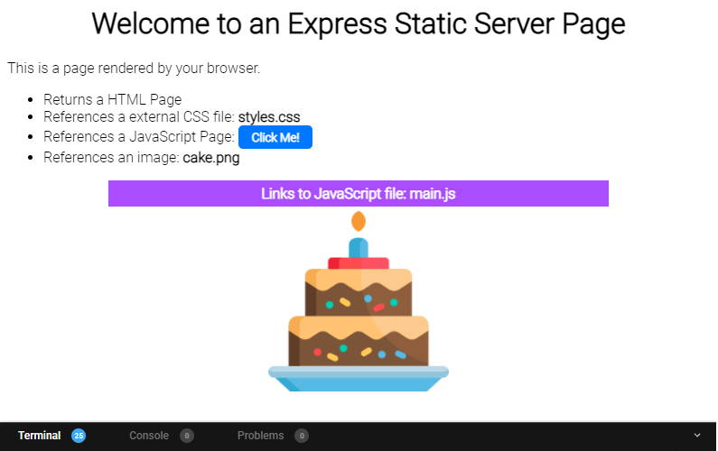

# Session 5 Starter Files: Task 1

For this task you are going to create a static file server using express.
The server will return a single [index.html](./src/public/index.html) page as the homepage.

When a user visits the following URL, the [index.html](./src/public/index.html)  page will be displayed:
https://localhost:8080/

Ensure all the necessary node libraries have been installed

```
npm install
```

Add code to [index.js](./src/index.js) to enable static files (images, css, js files) to be served from a _virtual path_ called **content** and the physical directory **public**. Use middleware and the `express.static` methods.

Visiting the path: http://localhost:8080/content/images/cake.png should display an image of a cake.

Test your code by running the server:

```
 npm start
```

The final server should produce the following page:

The page should contain CSS styles from an external file
There should be an image displayed and clicking the "Click Me!" button should display a banner.

No changes need to be made to the [index.html](./src/public/index.html). To complete the task add code to [index.js](./src/index.js).

