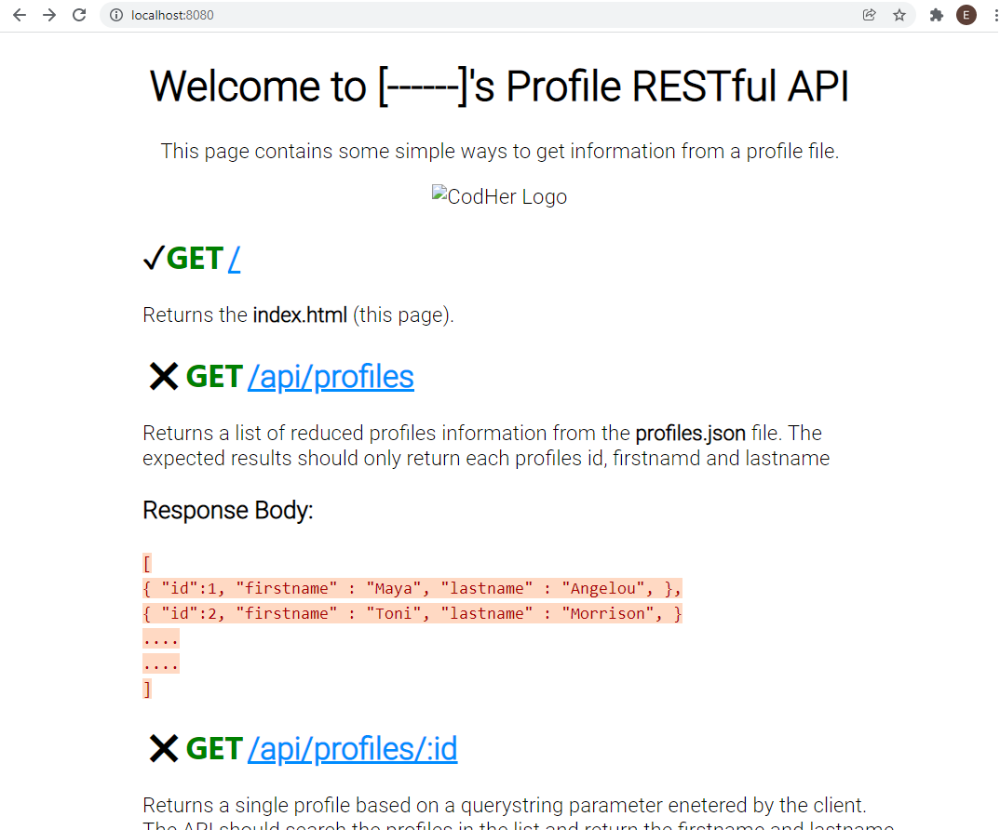

# Session 5 Starter Files: Task 2

Ensure all the necessary node libraries have been installed

```
npm install
```

Start the server with the command below:

```
 npm start
```

Once up and running read the homepage [index.html](./src/public/index.html)

Update the title to include your name: Welcome to [----]'s API

Add the functionality for all the endpoints described on the homepage. The endpoints with a cross () have not been implemented.

Add the relevant code to return the describe responses and statuses.

1. `GET /api/profiles`
1. `GET /api/profiles/:id`
1. `POST /api/profiles`
1. `PUT /api/profiles/:id`
1. `PATCH /api/profiles/:id`
1. `DELETE /api/profiles/:id`

Once you have added the working functionality, update the  [index.html](./src/public/index.html) bullet points from a cross (&#10007;) to a tick (&#10004;). 

```HTML
  <li class="cross">
  <li class="tick">
```

## Homepage: index.html


